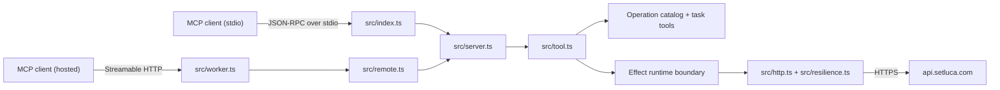

# Architecture

Luca MCP ships two transports from one tool catalog.

The stdio server is an npm package (`@setluca/mcp`). An MCP client starts the
process, sends JSON-RPC over stdin and stdout, and gets Luca API results back as
MCP tool content. The remote server is a Cloudflare Worker (`setluca-mcp` at
`mcp.setluca.com`) that speaks Streamable HTTP and authenticates a bearer token.

Both transports build tools from the same catalog, so they expose the same
operations. They differ in how a request arrives and how the server
authenticates it. Permissions stay the same.

## Modules

Entry points:

- `src/index.ts`: stdio entrypoint.
- `src/worker.ts`: Cloudflare Worker entry for the remote transport. The build
  tsconfig excludes it, so the npm tarball stays stdio-only.
- `src/remote.ts`: the Streamable HTTP handler and the bearer-token resolvers.
  One server and transport per request, no session affinity.
- `src/oauth-resolver.ts`: resolves an OAuth access token to a coach-scoped
  identity through the Luca API.

Registration:

- `src/server.ts`: builds the `McpServer` and registers tools, resources,
  prompts, and completions.
- `src/tool.ts`: the one pipeline every tool goes through. Operation tools and
  task tools both project into `RegisterableTool` and register identically.
- `src/tool-cache.ts`: memoizes the derived tool definitions so the Worker
  doesn't rebuild every Effect schema on each request.
- `src/annotations.ts`: decides what a client is told about a tool before it
  calls it (`readOnlyHint`, `destructiveHint`, `idempotentHint`).
- `src/resources.ts`, `src/prompts.ts`, `src/completions.ts`: the non-tool MCP
  surfaces. Completions cover `leadId` and `conversationId`, read live from
  `leads.list` and `conversations.list`. MCP completes prompt arguments and
  resource-template variables only, so a tool's enum fields are documented in
  their own JSON Schema instead.

Catalog:

- `src/operations/`: the source of truth for tool metadata and request mapping.
  `groups/` holds one file per operation group, `catalog.ts` assembles them,
  `registry.ts` builds each operation's schemas, and `manifest.ts` renders the
  `luca://operations` resource. `src/operations.ts` re-exports the public parts.
- `src/task-tools/`: the hand-written intent-level tools that compose several
  operations behind one call.
- `src/generated/`: schemas generated from `apps/api/openapi.json`. Never edit
  these by hand. Tool inputs are generated as Effect Schema source, converted by
  `src/openapi-schema.ts` at generation time. Outputs stay JSON Schema, and the
  server converts them at runtime.

Transport and behavior:

- `src/http.ts`: the Effect-backed Luca API client. Builds the URL, auth
  headers, workspace headers, optional JSON body, and idempotency header.
- `src/resilience.ts`: per-attempt timeout and the retry schedule.
- `src/pagination.ts` and `src/page-contract.ts`: the auto-paginating walk and the
  per-route page shape it reads.
- `src/provenance.ts`: frames lead-authored text as untrusted content.
- `src/config.ts`, `src/errors.ts`, `src/serialization.ts`,
  `src/observability.ts`: configuration, typed errors, the JSON boundary, and
  structured logging.

Scripts:

- `scripts/check-openapi.ts`: checks that registered operations still exist in
  the OpenAPI document (`apps/api/openapi.json` by default, `--live` for the
  deployed document).
- `scripts/generate-route-catalog.ts`, `scripts/generate-openapi-inputs.ts`,
  `scripts/generate-openapi-outputs.ts`: regenerate `src/generated/`.
- `scripts/generate-docs.ts`: generates the tool reference from the catalog.
- `scripts/check-registry.ts`: guards `server.json` against drift.

## Request flow

1. An MCP client calls a `luca_*` tool.
2. `src/tool.ts` parses the input and maps it into a `LucaRequest`.
3. A confirm-gated tool without `confirm: true` is rejected here, before any
   outbound request.
4. `src/http.ts` builds the URL, headers, body, and idempotency key.
5. `src/resilience.ts` bounds the attempt and retries a transient failure.
   Writes only retry when they carry an idempotency key.
6. A list route walks its pages up to `maxPages` and merges the results.
7. The server returns the decoded body as text content plus structured content,
   framed untrusted when the route carries lead-authored text.
8. Config, network, timeout, decode, and HTTP failures come back as MCP tool
   errors with the API's own error body intact.

## Design rules

- Public API only. Never add database, internal route, or browser-cookie access.
- The operation catalog owns tool names, scopes, paths, and idempotency.
- Writes must preserve Luca's idempotency contract.
- Any operation added under `src/operations/groups/` must pass
  `bun run openapi:check`.
- Any catalog change must regenerate `docs/tools.md`.
